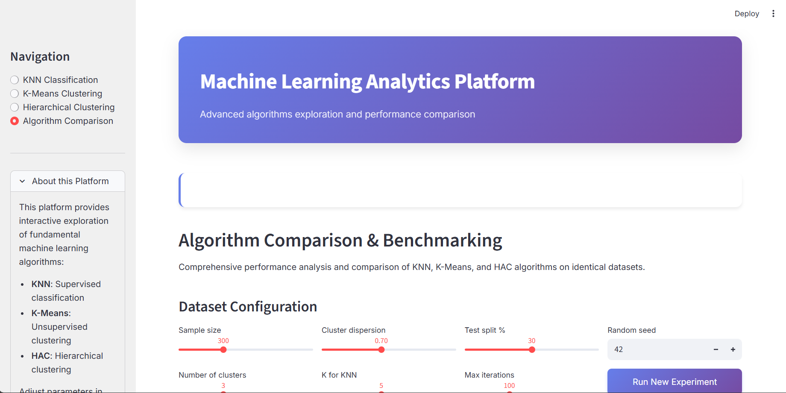

#  Machine Learning Interactive Dashboard

[](https://www.python.org/downloads/)
[](https://streamlit.io/)
[](LICENSE)
[](https://github.com/yourusername)

> **Une application web interactive pour explorer et comparer les algorithmes fondamentaux du Machine Learning : KNN, K-Means et Classification Ascendante Hiérarchique (CAH)**



##  Fonctionnalités

###  Trois Algorithmes Implémentés from Scratch
- **KNN (K-Nearest Neighbors)** - Classification supervisée
- **K-Means** - Clustering par partitionnement
- **CAH (Hierarchical Clustering)** - Clustering hiérarchique

###  Interface Moderne
- Design moderne avec gradients et glassmorphism
- Animations fluides et transitions CSS
- Interface responsive et intuitive
- Visualisations matplotlib enrichies

###  Outils d'Analyse
- **Génération de données synthétiques** personnalisable
- **Méthode du coude** pour K-Means
- **Dendrogrammes interactifs** pour la CAH
- **Métriques de performance** en temps réel
- **Comparaison côte à côte** des algorithmes

###  Paramètres Ajustables
- Nombre d'échantillons
- Niveau de bruit
- Nombre de clusters
- Paramètres spécifiques à chaque algorithme
- Seeds aléatoires pour la reproductibilité

##  Démarrage Rapide

### Prérequis
```bash
Python 3.8+
pip
```

### Installation

1. **Clonez le repository**
```bash
git clone https://github.com/yourusername/ml-interactive-dashboard.git
cd ml-interactive-dashboard
```

2. **Créez un environnement virtuel**
```bash
python -m venv venv
source venv/bin/activate  # Sur Windows: venv\Scripts\activate
```

3. **Installez les dépendances**
```bash
pip install -r requirements.txt
```

4. **Lancez l'application**
```bash
streamlit run streamlit_app.py
```

5. **Ouvrez votre navigateur**
```
L'application s'ouvre automatiquement sur http://localhost:8501
```

##  Structure du Projet

```
projet_ML/
│
├── streamlit_app.py           # Application principale Streamlit
├── requirements.txt           # Dépendances Python
├── README.md                  # Documentation
│
├── algorithms/                # Implémentations des algorithmes
│   ├── __init__.py
│   ├── knn.py                # K-Nearest Neighbors
│   ├── kmeans.py             # K-Means Clustering
│   └── hierarchical.py       # Hierarchical Clustering
│
├── assets/                    # Ressources (images, etc.)
│   └── dashboard_preview.png
│
└── tests/                     # Tests unitaires
    ├── __init__.py
    ├── test_knn.py
    ├── test_kmeans.py
    └── test_hierarchical.py
```

##  Algorithmes Détaillés

###  K-Nearest Neighbors (KNN)
**Classification supervisée basée sur la proximité**

```python
from algorithms.knn import KNN

# Initialisation
knn = KNN(k=5)

# Entraînement
knn.fit(X_train, y_train)

# Prédiction
predictions = knn.predict(X_test)
```

**Complexité :** O(n·d) où n = nombre d'échantillons, d = dimensions

**Avantages :**
-  Simple et intuitif
-  Pas de phase d'entraînement
-  Adaptatif aux nouvelles données

**Limitations :**
-  Lent pour la prédiction
-  Sensible au choix de k
-  Curse of dimensionality

###  K-Means Clustering
**Clustering non-supervisé par partitionnement**

```python
from algorithms.kmeans import KMeans

# Initialisation
kmeans = KMeans(k=3, max_iters=100)

# Clustering
labels = kmeans.fit(X)

# Centroïdes
centroids = kmeans.centroids
```

**Complexité :** O(n·d·k·i) où i = nombre d'itérations

**Avantages :**
-  Rapide et évolutif
-  Garantie de convergence
-  Efficace pour grands datasets

**Limitations :**
-  Nécessite de choisir k
-  Sensible à l'initialisation
-  Suppose des clusters sphériques

###  Classification Ascendante Hiérarchique (CAH)
**Clustering hiérarchique bottom-up**

```python
from algorithms.hierarchical import HierarchicalClustering

# Initialisation
cah = HierarchicalClustering(method='ward')

# Construction de l'arbre
linkage_matrix = cah.fit(X)

# Extraction des clusters
labels = cah.get_clusters(n_clusters=3)
```

**Complexité :** O(n³) en espace et temps

**Avantages :**
-  Visualisation hiérarchique (dendrogramme)
-  Pas besoin de k à l'avance
-  Capture des structures complexes

**Limitations :**
-  Très coûteux computationnellement
-  Sensible au bruit
-  Non adapté aux grands datasets

##  Captures d'Écran

### Page d'Accueil


### KNN - Classification


### K-Means - Méthode du Coude


### CAH - Dendrogramme


### Comparaison Globale


##  Technologies Utilisées

- **[Streamlit](https://streamlit.io/)** - Framework web interactif
- **[NumPy](https://numpy.org/)** - Calcul scientifique
- **[Matplotlib](https://matplotlib.org/)** - Visualisations
- **[Seaborn](https://seaborn.pydata.org/)** - Visualisations statistiques
- **[Scikit-learn](https://scikit-learn.org/)** - Métriques et datasets
- **[SciPy](https://scipy.org/)** - Calculs scientifiques avancés
- **[Pandas](https://pandas.pydata.org/)** - Manipulation de données

##  Métriques Implémentées

### Classification (KNN)
- **Accuracy** - Taux de prédictions correctes
- **Precision, Recall, F1-Score** - Métriques détaillées par classe
- **Classification Report** - Rapport complet

### Clustering (K-Means, CAH)
- **Silhouette Score** - Qualité de la séparation des clusters
- **Inertie** - Variance intra-cluster (K-Means)
- **Méthode du coude** - Détermination du k optimal

##  Cas d'Usage

###  Éducation
- Apprentissage interactif des algorithmes ML
- Visualisation des concepts abstraits
- Expérimentation avec différents paramètres

###  Recherche
- Prototypage rapide d'algorithmes
- Comparaison de performances
- Génération de datasets synthétiques

###  Professionnel
- Démonstration de concepts ML
- Sélection d'algorithmes appropriés
- Analyse exploratoire de données

##  Contribution

Les contributions sont les bienvenues ! Voici comment contribuer :

1. **Fork** le projet
2. **Créez** votre branche (`git checkout -b feature/AmazingFeature`)
3. **Commit** vos changements (`git commit -m 'Add AmazingFeature'`)
4. **Push** vers la branche (`git push origin feature/AmazingFeature`)
5. **Ouvrez** une Pull Request

### Guidelines
- Suivre le style de code existant
- Ajouter des tests pour les nouvelles fonctionnalités
- Mettre à jour la documentation
- Commenter le code complexe

##  Roadmap

- [ ] Ajout de nouveaux algorithmes (SVM, Random Forest, DBSCAN)
- [ ] Support des datasets personnalisés (upload CSV)
- [ ] Export des résultats et visualisations
- [ ] Mode comparaison avancée avec cross-validation
- [ ] API REST pour l'accès programmatique
- [ ] Tutoriels interactifs intégrés
- [ ] Support multilingue
- [ ] Mode sombre

##  Bugs Connus

- Performance dégradée avec CAH pour n > 500 échantillons
- Pas de support pour données >2D dans les visualisations

##  License

Ce projet est sous licence MIT - voir le fichier [LICENSE](LICENSE) pour plus de détails.

##  Auteur

**Votre Nom**
- GitHub: [@yourusername](https://github.com/yourusername)
- LinkedIn: [Votre Profil](https://linkedin.com/in/yourprofile)
- Email: your.email@example.com

##  Remerciements

- Merci à la communauté Streamlit pour l'excellent framework
- Inspiration tirée des cours de Machine Learning de Stanford
- Datasets synthétiques générés avec Scikit-learn

##  Ressources Additionnelles

- [Documentation Streamlit](https://docs.streamlit.io/)
- [Scikit-learn User Guide](https://scikit-learn.org/stable/user_guide.html)
- [Pattern Recognition and Machine Learning - Bishop](https://www.springer.com/gp/book/9780387310732)
- [The Elements of Statistical Learning - Hastie et al.](https://web.stanford.edu/~hastie/ElemStatLearn/)

##  Star History

[](https://star-history.com/#yourusername/ml-interactive-dashboard&Date)

---

<div align="center">
    <p>Fait avec ❤️ et ☕</p>
    <p>Si ce projet vous a aidé, n'oubliez pas de lui donner une ⭐</p>
</div>
